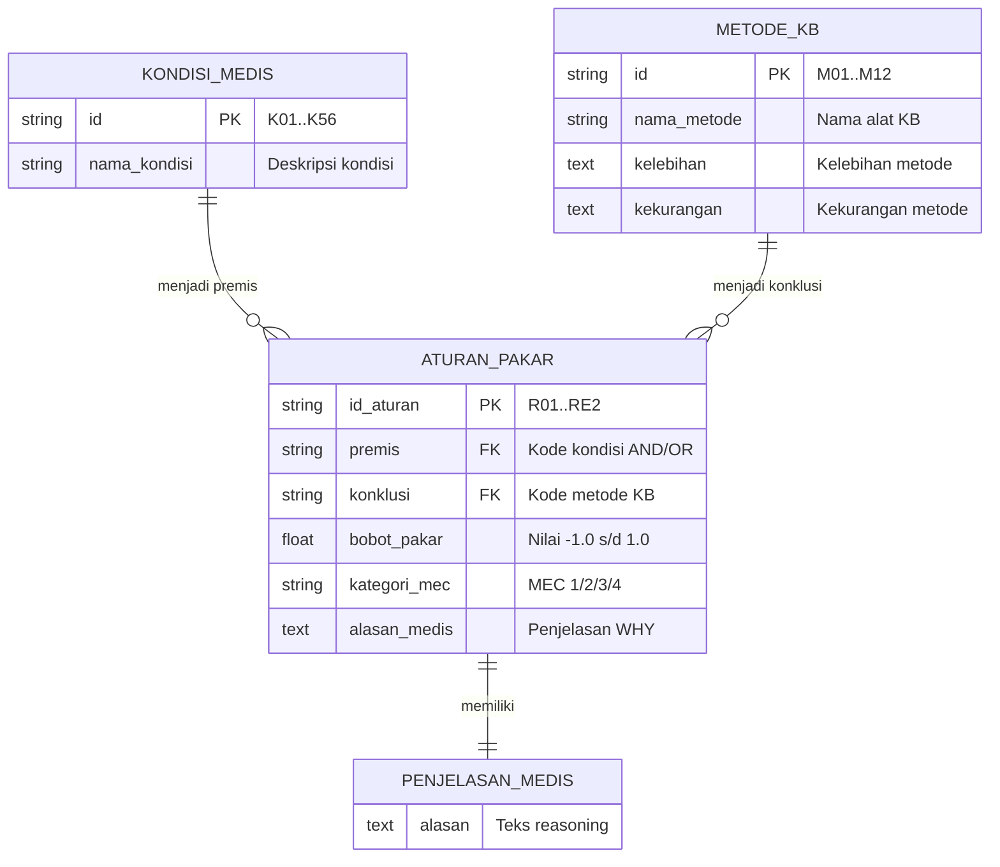
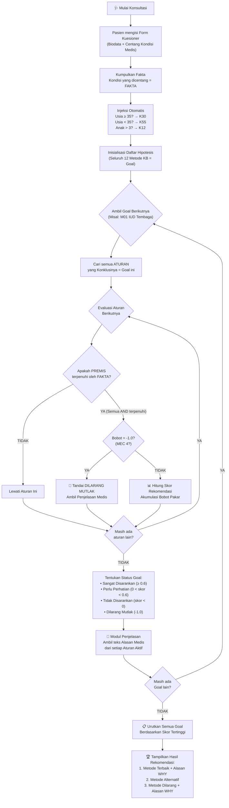
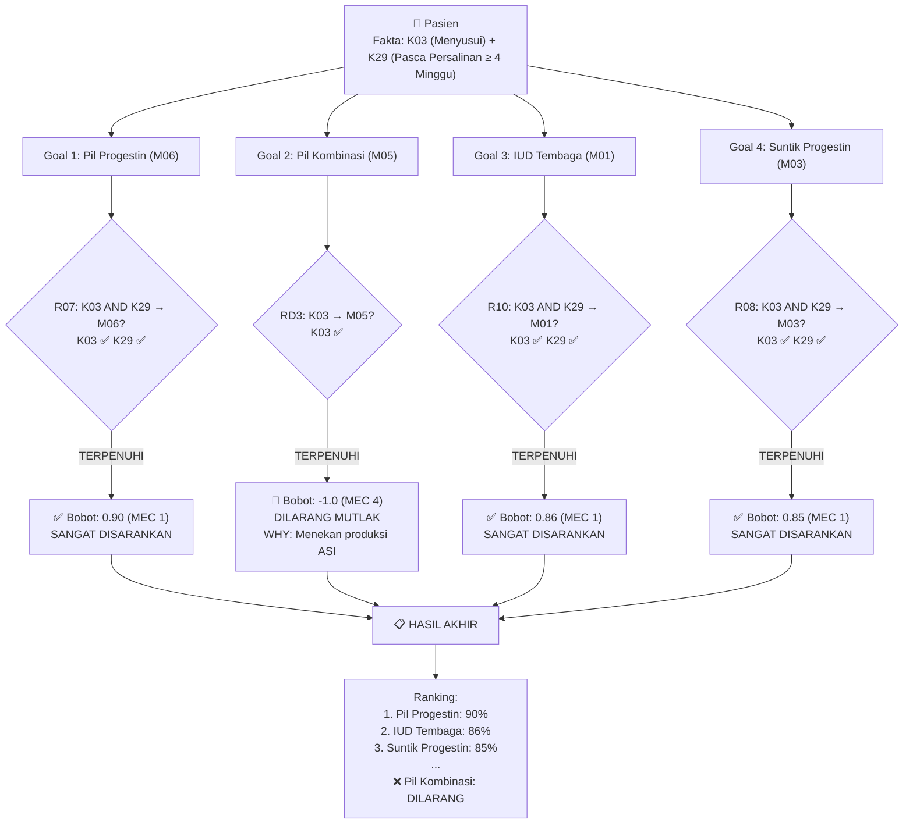
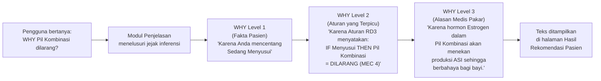

# 3. CONCEPTUALIZATION DAN FORMALIZATION

## 3.1 Identifikasi Konsep Pengetahuan

Sistem pakar pemilihan alat kontrasepsi ini dibangun berdasarkan empat konsep pengetahuan utama yang saling berinteraksi dalam proses penalaran:

### A. Kondisi Medis (Fakta / Evidence)
Kondisi medis merupakan **fakta klinis** yang melekat pada pasien. Fakta ini dikumpulkan melalui antarmuka kuesioner interaktif dan menjadi masukan (*input*) utama bagi mesin inferensi. Dalam konteks Backward Chaining, fakta digunakan untuk **membuktikan atau menggugurkan hipotesis** yang sedang dievaluasi.

Sistem ini mengelola **56 kondisi medis** yang dikategorikan ke dalam 4 kelompok:

| Kategori | Contoh Kondisi | Jumlah |
|----------|---------------|--------|
| Umum & Reproduksi | Sehat/Fisik Normal, Sedang Menyusui, Siklus Haid Teratur, Obesitas, Baru Menikah, dll. | 22 |
| Kardiovaskular & Saraf | Hipertensi (Umum & Berat), Riwayat Jantung, Stroke, Migrain (dengan/tanpa Aura), DVT/Emboli Paru, dll. | 12 |
| Penyakit Kronis & Infeksi | Diabetes (<20 thn & >20 thn), Anemia, HIV Stabil, TBC, Sirosis Hati, Lupus, Epilepsi, dll. | 12 |
| Kandungan & Tumor | Kanker Payudara (Aktif & Remisi), Kanker Serviks, Benjolan Payudara Jinak, PID Aktif, Pendarahan Vagina, dll. | 10 |

### B. Hipotesis Target (Metode Kontrasepsi / Goal)
Hipotesis target merupakan **konklusi yang akan dibuktikan** oleh mesin inferensi melalui penalaran mundur (*Backward Chaining*). Setiap metode kontrasepsi diperlakukan sebagai **satu hipotesis (*Goal*)** yang akan dievaluasi kelayakannya berdasarkan fakta kondisi pasien.

Sistem mengelola **12 metode kontrasepsi** sebagai hipotesis target:

| ID | Nama Metode KB | Klasifikasi |
|----|---------------|-------------|
| M01 | IUD Tembaga (Cu-IUD) | Non-hormonal, Jangka Panjang |
| M02 | IUD Hormonal (LNG-IUD) | Hormonal Progestin, Jangka Panjang |
| M03 | Suntik Progestin 3 Bulan (DMPA) | Hormonal Progestin, Jangka Menengah |
| M04 | Suntik Kombinasi 1 Bulan | Hormonal Kombinasi, Jangka Pendek |
| M05 | Pil Kombinasi (CHC) | Hormonal Kombinasi, Jangka Pendek |
| M06 | Pil Progestin (POP / Minipil) | Hormonal Progestin, Jangka Pendek |
| M07 | Implan (AKBK) | Hormonal Progestin, Jangka Panjang |
| M08 | Kondom | Non-hormonal, Barier |
| M09 | Koyo Kontrasepsi (Patch) | Hormonal Kombinasi, Jangka Pendek |
| M10 | Cincin Vagina (Vaginal Ring) | Hormonal Kombinasi, Jangka Pendek |
| M11 | Testpack (Skrining Kehamilan Tunda KB) | Skrining |
| M12 | Vasektomi | Non-hormonal, Permanen |

### C. Aturan Pakar (Rules / Knowledge Base)
Aturan pakar merupakan **representasi pengetahuan formal** dari pakar (Bidan/Dokter) yang disusun dalam format *Production Rules* (IF-THEN). Setiap aturan menghubungkan satu atau lebih **premis (kondisi medis)** dengan satu **konklusi (metode KB)**, disertai **bobot pakar** yang merepresentasikan tingkat kelayakan berdasarkan pedoman WHO Medical Eligibility Criteria (MEC).

Klasifikasi bobot pakar mengikuti standar WHO MEC:

| Kategori MEC | Rentang Bobot | Interpretasi Klinis |
|:---:|:---:|---|
| **MEC 1** | 0.80 – 1.00 | Sangat aman, tidak ada pembatasan penggunaan |
| **MEC 2** | 0.60 – 0.79 | Aman dengan sedikit perhatian, manfaat > risiko |
| **MEC 3** | -0.01 – -0.99 | Tidak dianjurkan, risiko > manfaat |
| **MEC 4** | -1.00 | **Kontraindikasi absolut**, dilarang mutlak |

### D. Penjelasan Medis (Explanation / Reasoning)
Penjelasan medis merupakan komponen **Modul Penjelasan (*Explanation Facility*)** dalam arsitektur sistem pakar. Setiap aturan yang terpicu oleh mesin inferensi memiliki teks penjelasan medis yang disimpan dalam basis data, yang menjelaskan **mengapa (*why*)** suatu metode direkomendasikan atau dilarang untuk kondisi tertentu. Komponen ini menjawab pertanyaan "WHY" dari pengguna terhadap setiap keputusan yang dihasilkan sistem.

---

## 3.2 Struktur Pengetahuan

### A. Tabel Entitas Kondisi Medis (Fakta)

| ID | Nama Kondisi / Penyakit |
|:--:|---|
| K01 | Hipertensi (Umum) |
| K02 | Riwayat Penyakit Jantung |
| K03 | Sedang menyusui (Umum) |
| K04 | Ingin menunda kehamilan |
| K05 | Sehat / Fisik normal (tanpa komplikasi penyerta) |
| K06 | Siklus haid teratur |
| K07 | Tekanan darah normal |
| K08 | Obesitas |
| K09 | Hipertensi Ringan (Sistolik 140–159 atau Diastolik 90–99 mmHg) |
| K10 | Terdapat benjolan payudara jinak (non-kanker) |
| K11 | Terdapat kanker payudara aktif |
| K12 | Memiliki anak lebih dari 3 |
| K13 | Ingin jarak kehamilan panjang |
| K14 | Baru menikah |
| K15 | Ingin jarak kehamilan pendek |
| K16 | Menderita Diabetes < 20 tahun |
| K17 | Tanpa komplikasi (ginjal/mata/saraf) |
| K18 | Butuh perlindungan jangka panjang (5–10 tahun) |
| K19 | Tidak memiliki riwayat tumor |
| K20 | Butuh perlindungan menengah (3 tahun) |
| K21 | Takut pada efek samping hormonal |
| K22 | Butuh efektivitas perlindungan tinggi |
| K23 | Memiliki kedisiplinan tinggi (rutin minum obat) |
| K24 | Ingin metode yang mudah dihentikan |
| K25 | Data anamnesa medis pasien tidak lengkap |
| K26 | Punya komorbiditas/penyakit kronis berat |
| K27 | Pasca persalinan < 21 hari |
| K28 | Menyusui secara eksklusif |
| K29 | Pasca persalinan >= 4 minggu |
| K30 | Usia >= 35 tahun |
| K31 | Merokok >= 15 batang/hari |
| K32 | Hipertensi berat (Sistolik >= 160 atau Diastolik >= 100 mmHg) |
| K33 | Riwayat Penyakit Jantung Iskemik |
| K34 | Riwayat Stroke |
| K35 | Migrain dengan aura (gangguan saraf tepi/visual) |
| K36 | Migrain tanpa aura |
| K37 | Pendarahan vagina tidak wajar (belum dievaluasi) |
| K38 | Kanker Serviks (menunggu pengobatan bedah/radiasi) |
| K39 | Anemia (Defisiensi Besi) / Riwayat Anemia |
| K40 | Sedang menderita / Riwayat Trombosis Vena Dalam (DVT) / Emboli Paru |
| K41 | Menderita Diabetes > 20 tahun |
| K42 | Terdapat komplikasi diabetes (Nefropati/Retinopati/Neuropati) |
| K43 | Sirosis Hati Dekompensata (Berat) |
| K44 | Tumor / Kanker Hati |
| K45 | Lupus (SLE) dengan antibodi antifosfolipid positif |
| K46 | Penyakit Radang Panggul (PID) aktif / Servisitis |
| K47 | Konsumsi rutin obat Anti-kejang / Epilepsi (Karbamazepin, dll) |
| K48 | Multi-risiko Kardiovaskular (Tua + Merokok + Hipertensi) |
| K49 | Pasca Keguguran (Trimester 1 atau 2) tanpa komplikasi infeksi |
| K50 | Terinfeksi HIV klinis stabil & terapi ARV rutin |
| K51 | Kanker Payudara dengan masa remisi > 5 tahun (tanpa kekambuhan) |
| K52 | Sedang mengonsumsi obat TBC (Rifampisin) |
| K53 | Memiliki Penyakit Kandung Empedu (aktif diobati) |
| K54 | Merokok aktif (Umum) |
| K55 | Usia < 35 tahun |
| K56 | Baru mengalami keguguran / Aborsi (< 7 hari) |

### B. Diagram Relasi Antar Entitas

---

## 3.3 Basis Aturan (Rule Base)

Sistem ini memiliki total **99 aturan** yang terbagi menjadi dua kelompok utama: **Aturan Rekomendasi Positif (MEC 1–2)** dan **Aturan Larangan/Kontraindikasi (MEC 3–4)**.

### A. Aturan Rekomendasi Positif (MEC 1–2) — 76 Aturan

#### Wanita Sehat / Kondisi Normal

| ID | Aturan (IF → THEN) | Bobot | MEC |
|:--:|---|:---:|:---:|
| R01 | IF Sehat/Fisik Normal (K05) AND Tekanan Darah Normal (K07) THEN IUD Tembaga (M01) | 0.88 | 1 |
| R02 | IF Sehat/Fisik Normal (K05) AND Tekanan Darah Normal (K07) THEN IUD Hormonal (M02) | 0.85 | 1 |
| R03 | IF Sehat/Fisik Normal (K05) AND Siklus Haid Teratur (K06) THEN Pil Kombinasi (M05) | 0.90 | 1 |
| R04 | IF Sehat/Fisik Normal (K05) AND Siklus Haid Teratur (K06) THEN Suntik Kombinasi 1 Bulan (M04) | 0.85 | 1 |
| R05 | IF Sehat/Fisik Normal (K05) AND Tekanan Darah Normal (K07) AND Siklus Haid Teratur (K06) THEN Koyo Kontrasepsi (M09) | 0.82 | 1 |
| R06 | IF Sehat/Fisik Normal (K05) AND Tekanan Darah Normal (K07) AND Siklus Haid Teratur (K06) THEN Cincin Vagina (M10) | 0.80 | 1 |

#### Menyusui & Pasca Persalinan

| ID | Aturan (IF → THEN) | Bobot | MEC |
|:--:|---|:---:|:---:|
| R07 | IF Sedang Menyusui (K03) AND Pasca Persalinan >= 4 Minggu (K29) THEN Pil Progestin (M06) | 0.90 | 1 |
| R08 | IF Sedang Menyusui (K03) AND Pasca Persalinan >= 4 Minggu (K29) THEN Suntik Progestin 3 Bulan (M03) | 0.85 | 1 |
| R09 | IF Sedang Menyusui (K03) AND Pasca Persalinan >= 4 Minggu (K29) THEN Implan (M07) | 0.88 | 1 |
| R10 | IF Sedang Menyusui (K03) AND Pasca Persalinan >= 4 Minggu (K29) THEN IUD Tembaga (M01) | 0.86 | 1 |
| R11 | IF Menyusui Eksklusif (K28) AND Pasca Persalinan >= 4 Minggu (K29) THEN IUD Tembaga (M01) | 0.88 | 1 |
| R12 | IF Menyusui Eksklusif (K28) AND Pasca Persalinan >= 4 Minggu (K29) THEN Pil Progestin (M06) | 0.92 | 1 |

#### Jarak Kehamilan Panjang & Perlindungan Jangka Panjang

| ID | Aturan (IF → THEN) | Bobot | MEC |
|:--:|---|:---:|:---:|
| R13 | IF Ingin Jarak Kehamilan Panjang (K13) AND Butuh Perlindungan 5–10 Tahun (K18) THEN IUD Tembaga (M01) | 0.92 | 1 |
| R14 | IF Ingin Jarak Kehamilan Panjang (K13) AND Butuh Perlindungan 5–10 Tahun (K18) THEN IUD Hormonal (M02) | 0.90 | 1 |
| R15 | IF Ingin Jarak Kehamilan Panjang (K13) AND Butuh Perlindungan 5–10 Tahun (K18) THEN Implan (M07) | 0.88 | 1 |
| R16 | IF Ingin Menunda Kehamilan (K04) AND Butuh Perlindungan 3 Tahun (K20) THEN Implan (M07) | 0.88 | 1 |
| R17 | IF Ingin Menunda Kehamilan (K04) AND Butuh Perlindungan 3 Tahun (K20) THEN Suntik Progestin 3 Bulan (M03) | 0.85 | 1 |

#### Anak Banyak & Efektivitas Tinggi

| ID | Aturan (IF → THEN) | Bobot | MEC |
|:--:|---|:---:|:---:|
| R18 | IF Anak > 3 (K12) AND Butuh Efektivitas Tinggi (K22) THEN IUD Tembaga (M01) | 0.92 | 1 |
| R19 | IF Anak > 3 (K12) AND Butuh Efektivitas Tinggi (K22) THEN IUD Hormonal (M02) | 0.90 | 1 |
| R20 | IF Anak > 3 (K12) AND Butuh Efektivitas Tinggi (K22) THEN Implan (M07) | 0.88 | 1 |

#### Baru Menikah

| ID | Aturan (IF → THEN) | Bobot | MEC |
|:--:|---|:---:|:---:|
| R21 | IF Baru Menikah (K14) AND Jarak Kehamilan Pendek (K15) THEN Pil Kombinasi (M05) | 0.85 | 1 |
| R22 | IF Baru Menikah (K14) AND Ingin Mudah Dihentikan (K24) THEN Pil Kombinasi (M05) | 0.82 | 1 |
| R23 | IF Baru Menikah (K14) AND Ingin Mudah Dihentikan (K24) THEN Kondom (M08) | 0.80 | 1 |

#### Disiplin Tinggi

| ID | Aturan (IF → THEN) | Bobot | MEC |
|:--:|---|:---:|:---:|
| R24 | IF Sehat/Fisik Normal (K05) AND Disiplin Tinggi (K23) THEN Pil Kombinasi (M05) | 0.88 | 1 |
| R25 | IF Sehat/Fisik Normal (K05) AND Disiplin Tinggi (K23) THEN Pil Progestin (M06) | 0.85 | 1 |

#### Takut Hormonal

| ID | Aturan (IF → THEN) | Bobot | MEC |
|:--:|---|:---:|:---:|
| R26 | IF Takut Efek Samping Hormonal (K21) AND Butuh Efektivitas Tinggi (K22) THEN IUD Tembaga (M01) | 0.92 | 1 |
| R27 | IF Takut Efek Samping Hormonal (K21) THEN Kondom (M08) | 0.78 | 1 |

#### Diabetes Tanpa Komplikasi

| ID | Aturan (IF → THEN) | Bobot | MEC |
|:--:|---|:---:|:---:|
| R28 | IF Diabetes < 20 Tahun (K16) AND Tanpa Komplikasi (K17) THEN IUD Tembaga (M01) | 0.85 | 1 |
| R29 | IF Diabetes < 20 Tahun (K16) AND Tanpa Komplikasi (K17) THEN Pil Progestin (M06) | 0.78 | 2 |
| R30 | IF Diabetes < 20 Tahun (K16) AND Tanpa Komplikasi (K17) THEN Suntik Progestin 3 Bulan (M03) | 0.75 | 2 |
| R31 | IF Diabetes < 20 Tahun (K16) AND Tanpa Komplikasi (K17) THEN Implan (M07) | 0.78 | 2 |

#### Hipertensi Ringan

| ID | Aturan (IF → THEN) | Bobot | MEC |
|:--:|---|:---:|:---:|
| R32 | IF Hipertensi Ringan (K09) THEN IUD Tembaga (M01) | 0.82 | 1 |
| R33 | IF Hipertensi Ringan (K09) THEN Suntik Progestin 3 Bulan (M03) | 0.72 | 2 |
| R34 | IF Hipertensi Ringan (K09) THEN Pil Progestin (M06) | 0.75 | 1 |
| R35 | IF Hipertensi Ringan (K09) THEN Implan (M07) | 0.78 | 1 |
| R36 | IF Hipertensi Ringan (K09) THEN Kondom (M08) | 0.70 | 1 |

#### Obesitas

| ID | Aturan (IF → THEN) | Bobot | MEC |
|:--:|---|:---:|:---:|
| R37 | IF Obesitas (K08) THEN IUD Tembaga (M01) | 0.82 | 1 |
| R38 | IF Obesitas (K08) THEN Implan (M07) | 0.78 | 1 |
| R39 | IF Obesitas (K08) THEN IUD Hormonal (M02) | 0.78 | 1 |

#### Anemia

| ID | Aturan (IF → THEN) | Bobot | MEC |
|:--:|---|:---:|:---:|
| R40 | IF Anemia (K39) THEN IUD Hormonal (M02) | 0.82 | 1 |
| R41 | IF Anemia (K39) THEN Suntik Progestin 3 Bulan (M03) | 0.78 | 1 |
| R42 | IF Anemia (K39) THEN Pil Kombinasi (M05) | 0.75 | 1 |

#### Pasca Keguguran

| ID | Aturan (IF → THEN) | Bobot | MEC |
|:--:|---|:---:|:---:|
| R43 | IF Pasca Keguguran Tanpa Infeksi (K49) THEN IUD Tembaga (M01) | 0.85 | 1 |
| R44 | IF Pasca Keguguran Tanpa Infeksi (K49) THEN Pil Kombinasi (M05) | 0.82 | 1 |
| R45 | IF Pasca Keguguran Tanpa Infeksi (K49) THEN Implan (M07) | 0.80 | 1 |

#### HIV Stabil

| ID | Aturan (IF → THEN) | Bobot | MEC |
|:--:|---|:---:|:---:|
| R46 | IF HIV Stabil + ARV (K50) THEN Kondom (M08) | 0.92 | 1 |
| R47 | IF HIV Stabil + ARV (K50) THEN IUD Tembaga (M01) | 0.80 | 1 |
| R48 | IF HIV Stabil + ARV (K50) THEN Suntik Progestin 3 Bulan (M03) | 0.75 | 1 |

#### Migrain Tanpa Aura

| ID | Aturan (IF → THEN) | Bobot | MEC |
|:--:|---|:---:|:---:|
| R49 | IF Migrain Tanpa Aura (K36) THEN Pil Progestin (M06) | 0.78 | 1 |
| R50 | IF Migrain Tanpa Aura (K36) THEN Suntik Progestin 3 Bulan (M03) | 0.72 | 2 |
| R51 | IF Migrain Tanpa Aura (K36) THEN IUD Tembaga (M01) | 0.80 | 1 |

#### Benjolan Payudara Jinak

| ID | Aturan (IF → THEN) | Bobot | MEC |
|:--:|---|:---:|:---:|
| R52 | IF Benjolan Payudara Jinak (K10) THEN IUD Tembaga (M01) | 0.82 | 1 |
| R53 | IF Benjolan Payudara Jinak (K10) THEN Kondom (M08) | 0.75 | 1 |

#### Data Tidak Lengkap

| ID | Aturan (IF → THEN) | Bobot | MEC |
|:--:|---|:---:|:---:|
| R54 | IF Data Anamnesa Tidak Lengkap (K25) THEN Kondom (M08) | 0.85 | 1 |
| R55 | IF Data Anamnesa Tidak Lengkap (K25) THEN Testpack/Skrining (M11) | 0.90 | 1 |

#### Kanker Payudara Remisi > 5 Tahun

| ID | Aturan (IF → THEN) | Bobot | MEC |
|:--:|---|:---:|:---:|
| R56 | IF Kanker Payudara Remisi > 5 Tahun (K51) THEN IUD Tembaga (M01) | 0.82 | 1 |
| R57 | IF Kanker Payudara Remisi > 5 Tahun (K51) THEN Kondom (M08) | 0.78 | 1 |

#### TBC / Rifampisin

| ID | Aturan (IF → THEN) | Bobot | MEC |
|:--:|---|:---:|:---:|
| R58 | IF Konsumsi Obat TBC (K52) THEN IUD Tembaga (M01) | 0.85 | 1 |
| R59 | IF Konsumsi Obat TBC (K52) THEN Kondom (M08) | 0.80 | 1 |
| R60 | IF Konsumsi Obat TBC (K52) THEN Suntik Progestin 3 Bulan (M03) | 0.78 | 1 |

#### Epilepsi (Obat Anti-kejang)

| ID | Aturan (IF → THEN) | Bobot | MEC |
|:--:|---|:---:|:---:|
| R61 | IF Epilepsi / Anti-kejang (K47) THEN IUD Tembaga (M01) | 0.85 | 1 |
| R62 | IF Epilepsi / Anti-kejang (K47) THEN Suntik Progestin 3 Bulan (M03) | 0.78 | 1 |
| R63 | IF Epilepsi / Anti-kejang (K47) THEN IUD Hormonal (M02) | 0.82 | 1 |

#### Penyakit Kandung Empedu

| ID | Aturan (IF → THEN) | Bobot | MEC |
|:--:|---|:---:|:---:|
| R64 | IF Penyakit Kandung Empedu (K53) THEN IUD Tembaga (M01) | 0.82 | 1 |
| R65 | IF Penyakit Kandung Empedu (K53) THEN Suntik Progestin 3 Bulan (M03) | 0.72 | 2 |

#### Merokok (Usia < 35 Tahun)

| ID | Aturan (IF → THEN) | Bobot | MEC |
|:--:|---|:---:|:---:|
| R66 | IF Usia < 35 (K55) AND Merokok (K54) THEN Pil Kombinasi (M05) | 0.65 | 2 |
| R67 | IF Usia < 35 (K55) AND Merokok (K54) THEN Suntik Progestin 3 Bulan (M03) | 0.78 | 1 |
| R68 | IF Usia < 35 (K55) AND Merokok (K54) THEN IUD Tembaga (M01) | 0.82 | 1 |

#### Pasca Persalinan < 21 Hari

| ID | Aturan (IF → THEN) | Bobot | MEC |
|:--:|---|:---:|:---:|
| R69 | IF Pasca Persalinan < 21 Hari (K27) THEN Pil Progestin (M06) | 0.82 | 1 |
| R70 | IF Pasca Persalinan < 21 Hari (K27) THEN Suntik Progestin 3 Bulan (M03) | 0.78 | 1 |
| R71 | IF Pasca Persalinan < 21 Hari (K27) THEN Implan (M07) | 0.80 | 1 |
| R72 | IF Pasca Persalinan < 21 Hari (K27) THEN Kondom (M08) | 0.75 | 1 |

#### Keguguran Baru (< 7 Hari)

| ID | Aturan (IF → THEN) | Bobot | MEC |
|:--:|---|:---:|:---:|
| R73 | IF Keguguran < 7 Hari (K56) THEN Kondom (M08) | 0.85 | 1 |
| R74 | IF Keguguran < 7 Hari (K56) THEN Testpack/Skrining (M11) | 0.80 | 1 |

#### Komorbiditas Berat (Umum)

| ID | Aturan (IF → THEN) | Bobot | MEC |
|:--:|---|:---:|:---:|
| R75 | IF Komorbiditas Berat (K26) THEN Kondom (M08) | 0.85 | 1 |
| R76 | IF Komorbiditas Berat (K26) THEN IUD Tembaga (M01) | 0.72 | 1 |

---

### B. Aturan Larangan / Kontraindikasi (MEC 3–4) — 23 Aturan

#### Kanker Payudara Aktif → Semua Metode Hormonal DILARANG MUTLAK

| ID | Aturan (IF → THEN) | Bobot | MEC |
|:--:|---|:---:|:---:|
| R77 | IF Kanker Payudara Aktif (K11) THEN Pil Kombinasi (M05) | **-1.0** | **4** |
| R78 | IF Kanker Payudara Aktif (K11) THEN Pil Progestin (M06) | **-1.0** | **4** |
| R79 | IF Kanker Payudara Aktif (K11) THEN IUD Hormonal (M02) | **-1.0** | **4** |
| R80 | IF Kanker Payudara Aktif (K11) THEN Suntik Progestin 3 Bulan (M03) | **-1.0** | **4** |
| R81 | IF Kanker Payudara Aktif (K11) THEN Implan (M07) | **-1.0** | **4** |
| R82 | IF Kanker Payudara Aktif (K11) THEN Suntik Kombinasi 1 Bulan (M04) | **-1.0** | **4** |
| R83 | IF Kanker Payudara Aktif (K11) THEN Koyo Kontrasepsi (M09) | **-1.0** | **4** |
| R84 | IF Kanker Payudara Aktif (K11) THEN Cincin Vagina (M10) | **-1.0** | **4** |

#### Hipertensi Berat → Kontrasepsi Hormonal Kombinasi (CHC) DILARANG

| ID | Aturan (IF → THEN) | Bobot | MEC |
|:--:|---|:---:|:---:|
| R85 | IF Hipertensi Berat (K32) THEN Pil Kombinasi (M05) | **-1.0** | **4** |
| R86 | IF Hipertensi Berat (K32) THEN Suntik Kombinasi 1 Bulan (M04) | **-1.0** | **4** |
| R87 | IF Hipertensi Berat (K32) THEN Koyo Kontrasepsi (M09) | **-1.0** | **4** |
| R88 | IF Hipertensi Berat (K32) THEN Cincin Vagina (M10) | **-1.0** | **4** |

#### Penyakit Jantung Iskemik → CHC DILARANG

| ID | Aturan (IF → THEN) | Bobot | MEC |
|:--:|---|:---:|:---:|
| R89 | IF Jantung Iskemik (K33) THEN Pil Kombinasi (M05) | **-1.0** | **4** |
| R90 | IF Jantung Iskemik (K33) THEN Suntik Kombinasi (M04) | **-1.0** | **4** |
| R91 | IF Jantung Iskemik (K33) THEN Koyo (M09) | **-1.0** | **4** |
| R92 | IF Jantung Iskemik (K33) THEN Cincin Vagina (M10) | **-1.0** | **4** |

#### Riwayat Stroke → CHC DILARANG

| ID | Aturan (IF → THEN) | Bobot | MEC |
|:--:|---|:---:|:---:|
| R93 | IF Riwayat Stroke (K34) THEN Pil Kombinasi (M05) | **-1.0** | **4** |
| R94 | IF Riwayat Stroke (K34) THEN Suntik Kombinasi (M04) | **-1.0** | **4** |
| R95 | IF Riwayat Stroke (K34) THEN Koyo (M09) | **-1.0** | **4** |
| R96 | IF Riwayat Stroke (K34) THEN Cincin Vagina (M10) | **-1.0** | **4** |

#### Migrain dengan Aura → CHC DILARANG

| ID | Aturan (IF → THEN) | Bobot | MEC |
|:--:|---|:---:|:---:|
| R97 | IF Migrain dengan Aura (K35) THEN Pil Kombinasi (M05) | **-1.0** | **4** |
| R98 | IF Migrain dengan Aura (K35) THEN Suntik Kombinasi (M04) | **-1.0** | **4** |
| R99 | IF Migrain dengan Aura (K35) THEN Koyo (M09) | **-1.0** | **4** |
| RA0 | IF Migrain dengan Aura (K35) THEN Cincin Vagina (M10) | **-1.0** | **4** |

#### DVT / Emboli Paru → CHC DILARANG

| ID | Aturan (IF → THEN) | Bobot | MEC |
|:--:|---|:---:|:---:|
| RA1 | IF DVT/Emboli Paru (K40) THEN Pil Kombinasi (M05) | **-1.0** | **4** |
| RA2 | IF DVT/Emboli Paru (K40) THEN Suntik Kombinasi (M04) | **-1.0** | **4** |
| RA3 | IF DVT/Emboli Paru (K40) THEN Koyo (M09) | **-1.0** | **4** |
| RA4 | IF DVT/Emboli Paru (K40) THEN Cincin Vagina (M10) | **-1.0** | **4** |

#### Sirosis Hati Berat → CHC DILARANG

| ID | Aturan (IF → THEN) | Bobot | MEC |
|:--:|---|:---:|:---:|
| RA5 | IF Sirosis Hati Berat (K43) THEN Pil Kombinasi (M05) | **-1.0** | **4** |
| RA6 | IF Sirosis Hati Berat (K43) THEN Suntik Kombinasi (M04) | **-1.0** | **4** |

#### Tumor / Kanker Hati → CHC DILARANG

| ID | Aturan (IF → THEN) | Bobot | MEC |
|:--:|---|:---:|:---:|
| RA7 | IF Tumor/Kanker Hati (K44) THEN Pil Kombinasi (M05) | **-1.0** | **4** |
| RA8 | IF Tumor/Kanker Hati (K44) THEN Suntik Kombinasi (M04) | **-1.0** | **4** |

#### Lupus (SLE) dengan Antibodi Antifosfolipid → CHC DILARANG

| ID | Aturan (IF → THEN) | Bobot | MEC |
|:--:|---|:---:|:---:|
| RA9 | IF Lupus + Antifosfolipid (K45) THEN Pil Kombinasi (M05) | **-1.0** | **4** |
| RB0 | IF Lupus + Antifosfolipid (K45) THEN Suntik Kombinasi (M04) | **-1.0** | **4** |
| RB1 | IF Lupus + Antifosfolipid (K45) THEN Koyo (M09) | **-1.0** | **4** |
| RB2 | IF Lupus + Antifosfolipid (K45) THEN Cincin Vagina (M10) | **-1.0** | **4** |

#### Usia >= 35 + Merokok Berat → CHC DILARANG

| ID | Aturan (IF → THEN) | Bobot | MEC |
|:--:|---|:---:|:---:|
| RB3 | IF Usia >= 35 (K30) AND Merokok Berat (K31) THEN Pil Kombinasi (M05) | **-1.0** | **4** |
| RB4 | IF Usia >= 35 (K30) AND Merokok Berat (K31) THEN Suntik Kombinasi (M04) | **-1.0** | **4** |
| RB5 | IF Usia >= 35 (K30) AND Merokok Berat (K31) THEN Koyo (M09) | **-1.0** | **4** |
| RB6 | IF Usia >= 35 (K30) AND Merokok Berat (K31) THEN Cincin Vagina (M10) | **-1.0** | **4** |

#### Multi-risiko Kardiovaskular → CHC DILARANG

| ID | Aturan (IF → THEN) | Bobot | MEC |
|:--:|---|:---:|:---:|
| RB7 | IF Multi-risiko Kardiovaskular (K48) THEN Pil Kombinasi (M05) | **-1.0** | **4** |
| RB8 | IF Multi-risiko Kardiovaskular (K48) THEN Suntik Kombinasi (M04) | **-1.0** | **4** |
| RB9 | IF Multi-risiko Kardiovaskular (K48) THEN Koyo (M09) | **-1.0** | **4** |
| RC0 | IF Multi-risiko Kardiovaskular (K48) THEN Cincin Vagina (M10) | **-1.0** | **4** |

#### Diabetes > 20 Tahun + Komplikasi → CHC DILARANG

| ID | Aturan (IF → THEN) | Bobot | MEC |
|:--:|---|:---:|:---:|
| RC1 | IF Diabetes > 20 Tahun (K41) AND Komplikasi Diabetes (K42) THEN Pil Kombinasi (M05) | **-1.0** | **4** |
| RC2 | IF Diabetes > 20 Tahun (K41) AND Komplikasi Diabetes (K42) THEN Suntik Kombinasi (M04) | **-1.0** | **4** |

#### Pasca Persalinan < 21 Hari → CHC DILARANG

| ID | Aturan (IF → THEN) | Bobot | MEC |
|:--:|---|:---:|:---:|
| RC3 | IF Pasca Persalinan < 21 Hari (K27) THEN Pil Kombinasi (M05) | **-1.0** | **4** |
| RC4 | IF Pasca Persalinan < 21 Hari (K27) THEN Suntik Kombinasi (M04) | **-1.0** | **4** |
| RC5 | IF Pasca Persalinan < 21 Hari (K27) THEN Koyo (M09) | **-1.0** | **4** |
| RC6 | IF Pasca Persalinan < 21 Hari (K27) THEN Cincin Vagina (M10) | **-1.0** | **4** |

#### PID Aktif → IUD DILARANG

| ID | Aturan (IF → THEN) | Bobot | MEC |
|:--:|---|:---:|:---:|
| RC7 | IF PID Aktif / Servisitis (K46) THEN IUD Tembaga (M01) | **-1.0** | **4** |
| RC8 | IF PID Aktif / Servisitis (K46) THEN IUD Hormonal (M02) | **-1.0** | **4** |

#### Pendarahan Vagina Tidak Wajar → IUD Perlu Hati-hati (MEC 3)

| ID | Aturan (IF → THEN) | Bobot | MEC |
|:--:|---|:---:|:---:|
| RC9 | IF Pendarahan Vagina Tidak Wajar (K37) THEN IUD Tembaga (M01) | -0.70 | 3 |
| RD0 | IF Pendarahan Vagina Tidak Wajar (K37) THEN IUD Hormonal (M02) | -0.70 | 3 |

#### Kanker Serviks → IUD Perlu Hati-hati (MEC 3)

| ID | Aturan (IF → THEN) | Bobot | MEC |
|:--:|---|:---:|:---:|
| RD1 | IF Kanker Serviks (K38) THEN IUD Tembaga (M01) | -0.60 | 3 |
| RD2 | IF Kanker Serviks (K38) THEN IUD Hormonal (M02) | -0.60 | 3 |

#### Menyusui → CHC DILARANG (Menekan Produksi ASI)

| ID | Aturan (IF → THEN) | Bobot | MEC |
|:--:|---|:---:|:---:|
| RD3 | IF Sedang Menyusui (K03) THEN Pil Kombinasi (M05) | **-1.0** | **4** |
| RD4 | IF Sedang Menyusui (K03) THEN Suntik Kombinasi (M04) | **-1.0** | **4** |
| RD5 | IF Sedang Menyusui (K03) THEN Koyo (M09) | **-1.0** | **4** |
| RD6 | IF Sedang Menyusui (K03) THEN Cincin Vagina (M10) | **-1.0** | **4** |

#### Hipertensi (Umum) → CHC Perlu Hati-hati (MEC 3)

| ID | Aturan (IF → THEN) | Bobot | MEC |
|:--:|---|:---:|:---:|
| RD7 | IF Hipertensi Umum (K01) THEN Pil Kombinasi (M05) | -0.60 | 3 |
| RD8 | IF Hipertensi Umum (K01) THEN Suntik Kombinasi (M04) | -0.60 | 3 |

#### Riwayat Penyakit Jantung → CHC DILARANG

| ID | Aturan (IF → THEN) | Bobot | MEC |
|:--:|---|:---:|:---:|
| RD9 | IF Riwayat Jantung (K02) THEN Pil Kombinasi (M05) | **-1.0** | **4** |
| RE0 | IF Riwayat Jantung (K02) THEN Suntik Kombinasi (M04) | **-1.0** | **4** |
| RE1 | IF Riwayat Jantung (K02) THEN Koyo (M09) | **-1.0** | **4** |
| RE2 | IF Riwayat Jantung (K02) THEN Cincin Vagina (M10) | **-1.0** | **4** |

---

## 3.4 Pohon Keputusan / Diagram Inferensi

### A. Arsitektur Mesin Inferensi (Backward Chaining)

### B. Contoh Skenario Inferensi

Berikut adalah contoh skenario inferensi *Backward Chaining* untuk seorang pasien dengan kondisi:
- **Sedang menyusui (K03)**
- **Pasca persalinan >= 4 minggu (K29)**

### C. Alur Modul Penjelasan (Explanation Facility) — Menjawab "WHY"

> **Catatan:** Seluruh aturan di atas disusun berdasarkan **WHO Medical Eligibility Criteria for Contraceptive Use (WHO MEC), Edisi ke-5 (2015)** dan telah divalidasi oleh pakar Bidan/Dokter.
